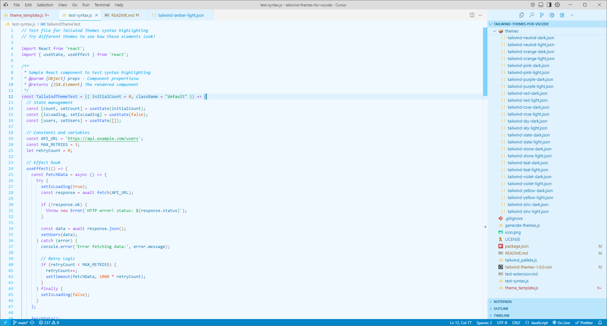
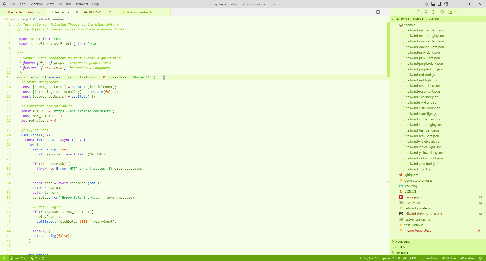

# Tailwind Themes for VS Code


A complete collection of VS Code themes using **ALL** Tailwind CSS color palettes. Choose from 44 beautiful themes, each featuring the official Tailwind CSS colors you know and love.


## 💙 If You Like This Project

**Show your support!** If these themes make your coding experience better, please consider:

[](https://github.com/dlandman27/tailwind-themes-for-vscode) [](https://buymeacoffee.com/dylandman287) [](https://twitter.com/intent/tweet?text=Check%20out%20these%20amazing%20Tailwind%20CSS%20themes%20for%20VS%20Code!&url=https://github.com/dlandman27/tailwind-themes-for-vscode)

## 📚 Table of Contents

- [🎨 Get the Color Palette](#-get-the-color-palette)
- [🚀 Installation](#-installation)
- [✨ Features](#-features)
- [📸 Theme Showcase](#-theme-showcase)
  - [Neutral Colors](#neutral-colors) • [Warm Colors](#warm-colors) • [Cool Colors](#cool-colors) • [Greens](#greens) • [Pinks & Purples](#pinks--purples)
- [🔧 Theme Structure](#-theme-structure)
- [🤝 Contributing](#-contributing)
- [📄 License](#-license)
- [☕ Support This Project](#-support-this-project)
- [🙏 Credits](#-credits)

> 🎨 **Color Reference**: See all Tailwind CSS colors at [tailwindcss.com/docs/colors](https://tailwindcss.com/docs/colors)

## 🎨 Get the Color Palette

Want to use these exact Tailwind colors in your own projects? We've got you covered!

### 📁 Download the Complete Palette
**[📥 tailwind_pallete.js](tailwind_pallete.js)** - Complete Tailwind CSS color palette with all hex values

*Each theme uses the full color scale for backgrounds, accents, and syntax highlighting.*

## 🚀 Installation

### Download from GitHub

1. **Download the Extension**:
   - Go to [Releases](https://github.com/dlandman27/tailwind-themes-for-vscode/releases)
   - Download the release tagged `latest`

2. **Install to VS Code**:
   ```bash
   code --install-extension tailwind-themes-1.0.0.vsix
   ```
   OR
   - Open VS Code
   - Press `Ctrl+Shift+P` (or `Cmd+Shift+P`)
   - Type "Extensions: Install from VSIX"
   - Select the downloaded `.vsix` file

3. **Activate themes**:
   - Go to `File > Preferences > Color Theme` (or `Code > Preferences > Color Theme` on Mac)
   - Look for themes starting with **"Tailwind"** (e.g., "Tailwind Blue Dark", "Tailwind Emerald Light")
   - Select your favorite theme from the list

## ✨ Features

- **Complete Tailwind Palette**: All 22 official Tailwind CSS color families
- **Perfect Color Harmony**: Each theme uses scientifically chosen color combinations
- **Light & Dark Variants**: Every color available in both light and dark modes
- **Consistent Design**: All themes follow the same professional structure
- **High Contrast**: Excellent readability for long coding sessions
- **Syntax Highlighting**: Carefully crafted colors for all programming languages

## 📸 Theme Showcase

### 📋 Quick Navigation
Jump to any color family:

| **Neutral Colors** | **Warm Colors** | **Cool Colors** | **Greens** | **Pinks & Purples** |
|:------------------:|:---------------:|:---------------:|:----------:|:--------------------:|
| [Slate](#slate) • [Gray](#gray) • [Zinc](#zinc) | [Red](#red) • [Orange](#orange) | [Sky](#sky) • [Blue](#blue) | [Lime](#lime) • [Green](#green) | [Violet](#violet) • [Purple](#purple) |
| [Neutral](#neutral) • [Stone](#stone) | [Amber](#amber) • [Yellow](#yellow) | [Indigo](#indigo) • [Cyan](#cyan) | [Emerald](#emerald) • [Teal](#teal) | [Fuchsia](#fuchsia) • [Pink](#pink) • [Rose](#rose) |

---

### Neutral Colors

#### Slate
**Theme Names**: `Tailwind Slate Light` • `Tailwind Slate Dark`

| Light Theme | Dark Theme |
|-------------|------------|
|  |  |

#### Gray
**Theme Names**: `Tailwind Gray Light` • `Tailwind Gray Dark`

| Light Theme | Dark Theme |
|-------------|------------|
|  |  |

#### Zinc
**Theme Names**: `Tailwind Zinc Light` • `Tailwind Zinc Dark`

| Light Theme | Dark Theme |
|-------------|------------|
|  |  |

#### Neutral
**Theme Names**: `Tailwind Neutral Light` • `Tailwind Neutral Dark`

| Light Theme | Dark Theme |
|-------------|------------|
|  |  |

#### Stone
**Theme Names**: `Tailwind Stone Light` • `Tailwind Stone Dark`

| Light Theme | Dark Theme |
|-------------|------------|
|  |  |

### Warm Colors

#### Red
**Theme Names**: `Tailwind Red Light` • `Tailwind Red Dark`

| Light Theme | Dark Theme |
|-------------|------------|
|  |  |

#### Orange
**Theme Names**: `Tailwind Orange Light` • `Tailwind Orange Dark`

| Light Theme | Dark Theme |
|-------------|------------|
|  |  |

#### Amber
**Theme Names**: `Tailwind Amber Light` • `Tailwind Amber Dark`

| Light Theme | Dark Theme |
|-------------|------------|
|  |  |

#### Yellow
**Theme Names**: `Tailwind Yellow Light` • `Tailwind Yellow Dark`

| Light Theme | Dark Theme |
|-------------|------------|
|  |  |

### Cool Colors

#### Sky
**Theme Names**: `Tailwind Sky Light` • `Tailwind Sky Dark`

| Light Theme | Dark Theme |
|-------------|------------|
|  |  |

#### Blue
**Theme Names**: `Tailwind Blue Light` • `Tailwind Blue Dark`

| Light Theme | Dark Theme |
|-------------|------------|
|  |  |

#### Indigo
**Theme Names**: `Tailwind Indigo Light` • `Tailwind Indigo Dark`

| Light Theme | Dark Theme |
|-------------|------------|
|  |  |

#### Cyan
**Theme Names**: `Tailwind Cyan Light` • `Tailwind Cyan Dark`

| Light Theme | Dark Theme |
|-------------|------------|
|  |  |

### Greens

#### Lime
**Theme Names**: `Tailwind Lime Light` • `Tailwind Lime Dark`

| Light Theme | Dark Theme |
|-------------|------------|
|  |  |

#### Green
**Theme Names**: `Tailwind Green Light` • `Tailwind Green Dark`

| Light Theme | Dark Theme |
|-------------|------------|
|  |  |

#### Emerald
**Theme Names**: `Tailwind Emerald Light` • `Tailwind Emerald Dark`

| Light Theme | Dark Theme |
|-------------|------------|
|  |  |

#### Teal
**Theme Names**: `Tailwind Teal Light` • `Tailwind Teal Dark`

| Light Theme | Dark Theme |
|-------------|------------|
|  |  |

### Pinks & Purples

#### Violet
**Theme Names**: `Tailwind Violet Light` • `Tailwind Violet Dark`

| Light Theme | Dark Theme |
|-------------|------------|
|  |  |

#### Purple
**Theme Names**: `Tailwind Purple Light` • `Tailwind Purple Dark`

| Light Theme | Dark Theme |
|-------------|------------|
|  |  |

#### Fuchsia
**Theme Names**: `Tailwind Fuchsia Light` • `Tailwind Fuchsia Dark`

| Light Theme | Dark Theme |
|-------------|------------|
|  |  |

#### Pink
**Theme Names**: `Tailwind Pink Light` • `Tailwind Pink Dark`

| Light Theme | Dark Theme |
|-------------|------------|
|  |  |

#### Rose
**Theme Names**: `Tailwind Rose Light` • `Tailwind Rose Dark`

| Light Theme | Dark Theme |
|-------------|------------|
|  |  |

## 🔧 Theme Structure

Each theme includes carefully mapped colors for:
- **Editor**: Background, text, cursors, selections, highlights
- **UI Elements**: Activity bar, sidebar, status bar, tabs, panels
- **Syntax Highlighting**: Keywords, strings, functions, classes, comments
- **Terminal**: Full ANSI color support
- **Git Integration**: Diff colors, blame annotations, merge conflicts

## 🤝 Contributing

Found an issue or have a suggestion? Feel free to:
- Open an issue on our [GitHub repository](https://github.com/dlandman27/tailwind-themes-for-vscode)
- Submit a pull request with improvements
- Share screenshots of your favorite themes

## 📄 License

MIT License - feel free to use these themes in any project!

## ☕ Support This Project

Love these themes? Consider buying me a coffee! Your support helps keep this project maintained and encourages the creation of more awesome VS Code extensions.

[](https://buymeacoffee.com/dylandman287)

**Other ways to support:**
- ⭐ **Star this repository** on GitHub
- 🐛 **Report bugs** or suggest improvements
- 💬 **Share it** with fellow developers
- 📝 **Write a review** after using the themes

## 📝 Changelog

### Version 1.0.2
- Reverted colors back to [900] from 950

### Version 1.0.1
- ✅ **Fixed title bar theming** - Title bar and menu bar now properly update with theme colors
- 🌚 **Darker backgrounds** - Dark themes now use Tailwind's darkest 950 shades for richer, deeper backgrounds
- 🎨 **Enhanced window chrome** - Better integration with VS Code's window elements

### Version 1.0.0
- 🎉 Initial release with 44 themes covering all Tailwind CSS color palettes
- 🌞 Light and dark variants for each color
- 🎨 Complete UI theming for VS Code interface

## 🙏 Credits

- **Tailwind CSS Team**: For creating the beautiful color palette that inspired these themes
- **VS Code Team**: For the amazing editor platform
- **Community**: For feedback and suggestions

*Note: This extension uses color values inspired by Tailwind CSS. Tailwind CSS is released under the MIT License.*

---

If you do end up using this, I hope it makes your experience as amazing as possible! 

**-Dylan Landman** 💙
